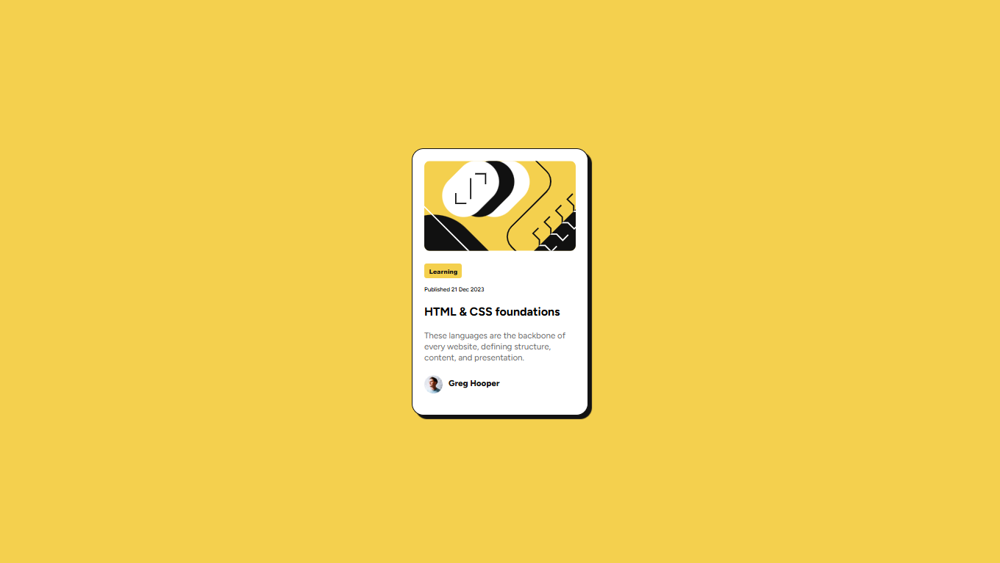

# Blog preview card

## Overview

Diseñar una tarjeta de blog que este centrada en la pantalla y llevar el flujo adaptativo de un mobile-first a fullscreen.

### Screenshot

### Links

- Solution URL: [Add solution URL here](https://github.com/Mauricio-Baez/blog-preview-card/tree/main)
- Live Site URL: [Add live site URL here](https://mauricio-baez.github.io/blog-preview-card/)

## My process

Empezar a diseñar por medio de una section la tarjeta, tratando de poner etiquetas semanticas y en los estilos empeze por el body con un display flex para centrar la tarjeta y asi llevar el flujo adaptativo a la pagina.

### Built with

- Semantic HTML5 markup
- CSS custom properties
- Flexbox
- CSS Grid
- Mobile-first workflow

### What I learned

Use this section to recap over some of your major learnings while working through this project. Writing these out and providing code samples of areas you want to highlight is a great way to reinforce your own knowledge.

## Author

- Website - [Mauricio-Baez](https://mauricio-baez.github.io/blog-preview-card/)
- Frontend Mentor - [@Mauricio-Baez](https://github.com/Mauricio-Baez/blog-preview-card)

## Acknowledgments

